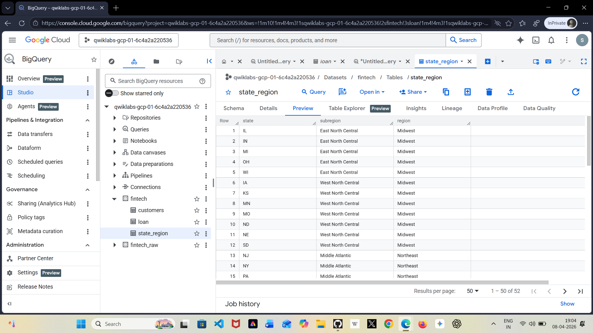
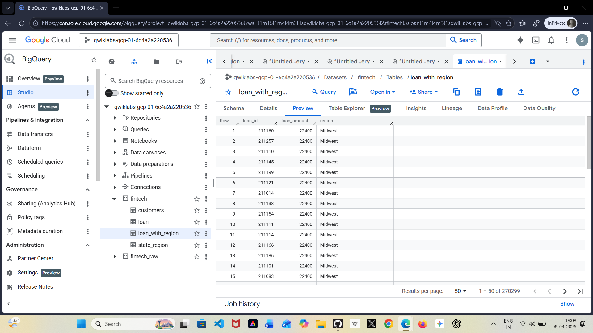
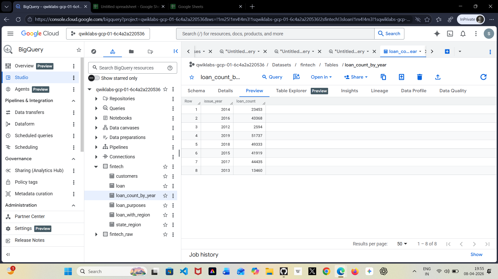
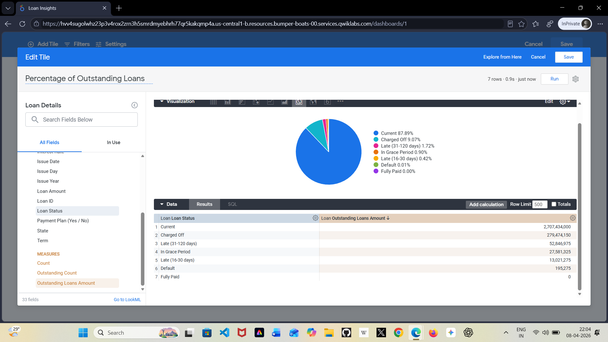
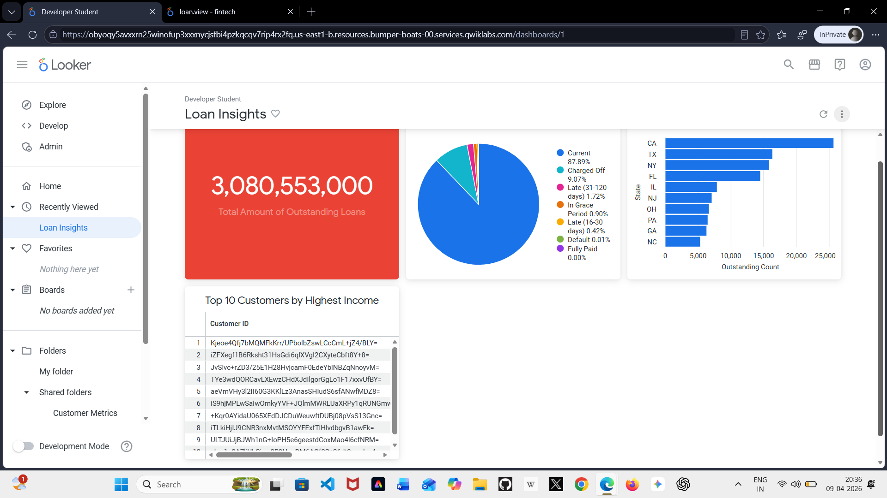

#  Google Cloud Loan Data Analytics Project

## Project Overview

This project focuses on analyzing financial loan data using Google Cloud tools. The main goal is to understand loan performance, customer behavior, and risk patterns through data analysis and visualization.
Using BigQuery, I explored and transformed raw loan datasets. Then, I used Looker to build interactive dashboards that provide insights into loan status, regional distribution, and customer trends.
This project simulates a real-world scenario where data is processed and visualized to support business decision-making in the financial sector.

## Objectives

- Analyze loan distribution across different regions  
- Track loan trends over time  
- Understand the status of loans (e.g., current, late, charged off)  
- Identify high-income customers with active loans  
- Build a dashboard for easy business insights  

## Tools & Technologies
- Google BigQuery
- SQL
- Looker (Data Visualization)
- Google Cloud Platform

## Key Tasks Performed

### Data Exploration
- Queried datasets using BigQuery
- Explored tables such as `loan`, `customers`, and `state_region`

### Data Transformation
- Created a joined dataset: `loan_with_region`
- Aggregated loan data by year: `loan_count_by_year`

### Data Visualization
- Built dashboards using Looker
- Visualizations include:
- Loan status distribution (Pie Chart)
- Total outstanding loan amount
- Loan distribution by state
- Top customers by income

##  Project Implementation

### State Region Mapping (BigQuery)

This table shows the mapping between states and their corresponding regions such as Midwest and Northeast.  
It is used to enrich the loan dataset by adding geographical information for region-based analysis.

### Loan Dataset with Region Information

In this step, I combined the loan dataset with regional data to create a new table (`loan_with_region`).  
This helps analyze loan distribution across different regions.

### Loan Count by Year (Aggregated Data)

This table shows the total number of loans issued each year.  
It helps identify trends and patterns in loan activity over time.

### Final Dashboard (Loan Insights)

This dashboard includes key visualizations such as total outstanding loans, loan status distribution, and regional analysis.  
It provides a complete overview of loan performance.

### Looker Visualization Setup

This step shows how visualizations were configured in Looker using dimensions and measures.  
It represents the process behind building the dashboard.
## Certification
[View Certificate]https://www.credly.com/badges/2b04771f-a739-436d-88bd-d518542ce229/public_url

## Skills Gained
- SQL querying
- Data Analysis
- Data modeling
- Data visualization
- Cloud-based analytics
